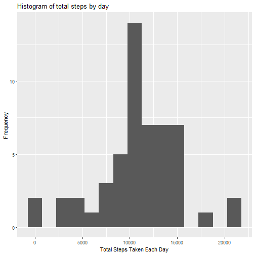
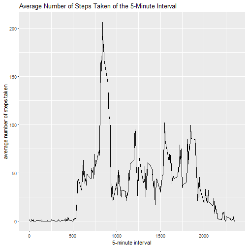
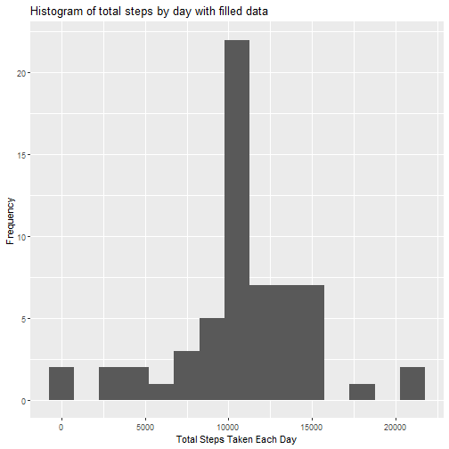
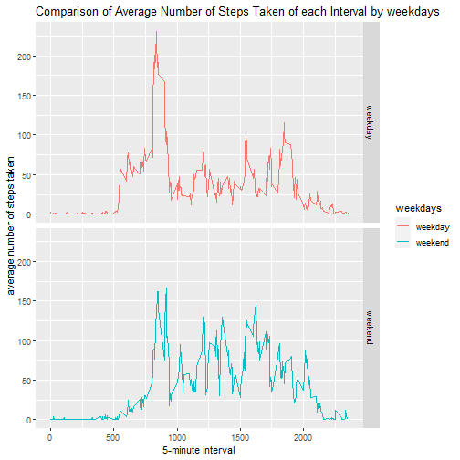

# Course4_Reproducible Research_week2_course project

## 1.Loading and preprocessing the data  
### Loading the data  

```r
        if(!file.exists("./data")){dir.create("./data")}
        fileUrl <- "https://d396qusza40orc.cloudfront.net/repdata%2Fdata%2Factivity.zip"
        download.file(fileUrl, destfile = "activity.zip", mode="wb")
```
### Unzip the data  

```r
        unzip("activity.zip")
        activityData <- read.csv("activity.csv", header = TRUE)
        head(activityData)
```

```
##   steps       date interval
## 1    NA 2012-10-01        0
## 2    NA 2012-10-01        5
## 3    NA 2012-10-01       10
## 4    NA 2012-10-01       15
## 5    NA 2012-10-01       20
## 6    NA 2012-10-01       25
```

```r
        str(activityData)
```

```
## 'data.frame':	17568 obs. of  3 variables:
##  $ steps   : int  NA NA NA NA NA NA NA NA NA NA ...
##  $ date    : Factor w/ 61 levels "2012-10-01","2012-10-02",..: 1 1 1 1 1 1 1 1 1 1 ...
##  $ interval: int  0 5 10 15 20 25 30 35 40 45 ...
```
  
## 2.What is mean total number of steps taken per day?  
## For this part of the assignment, you can ignore the missing values in the dataset.  
### Calculate the total number of steps taken per day  

```r
        totalSteps <- tapply(activityData$steps, activityData$date, FUN=sum)
        totalSteps
```

```
## 2012-10-01 2012-10-02 2012-10-03 
##         NA        126      11352 
## 2012-10-04 2012-10-05 2012-10-06 
##      12116      13294      15420 
## 2012-10-07 2012-10-08 2012-10-09 
##      11015         NA      12811 
## 2012-10-10 2012-10-11 2012-10-12 
##       9900      10304      17382 
## 2012-10-13 2012-10-14 2012-10-15 
##      12426      15098      10139 
## 2012-10-16 2012-10-17 2012-10-18 
##      15084      13452      10056 
## 2012-10-19 2012-10-20 2012-10-21 
##      11829      10395       8821 
## 2012-10-22 2012-10-23 2012-10-24 
##      13460       8918       8355 
## 2012-10-25 2012-10-26 2012-10-27 
##       2492       6778      10119 
## 2012-10-28 2012-10-29 2012-10-30 
##      11458       5018       9819 
## 2012-10-31 2012-11-01 2012-11-02 
##      15414         NA      10600 
## 2012-11-03 2012-11-04 2012-11-05 
##      10571         NA      10439 
## 2012-11-06 2012-11-07 2012-11-08 
##       8334      12883       3219 
## 2012-11-09 2012-11-10 2012-11-11 
##         NA         NA      12608 
## 2012-11-12 2012-11-13 2012-11-14 
##      10765       7336         NA 
## 2012-11-15 2012-11-16 2012-11-17 
##         41       5441      14339 
## 2012-11-18 2012-11-19 2012-11-20 
##      15110       8841       4472 
## 2012-11-21 2012-11-22 2012-11-23 
##      12787      20427      21194 
## 2012-11-24 2012-11-25 2012-11-26 
##      14478      11834      11162 
## 2012-11-27 2012-11-28 2012-11-29 
##      13646      10183       7047 
## 2012-11-30 
##         NA
```
  
### Make a histogram of the total number of steps taken each day  

```r
        library(ggplot2)
        qplot(totalSteps, binwidth=1500,
              xlab="Total Steps Taken Each Day",
              ylab = "Frequency",
              main = "Histogram of total steps by day")
```

```
## Warning: Removed 8 rows containing
## non-finite values (stat_bin).
```


  
### Calculate and report the mean and median of the total number of steps taken per day  

```r
        mean(totalSteps,na.rm = TRUE)
```

```
## [1] 10766.19
```

```r
        median(totalSteps, na.rm=TRUE)
```

```
## [1] 10765
```
        
          
## 3.What is the average daily activity pattern?  
### Make a time series plot (i.e.type="l") of the 5-minute interval (x-axis) and the average number of steps taken, averaged across all days (y-axis)  

```r
        averages <- aggregate(x=list(steps=activityData$steps), by=list(interval=activityData$interval),
                              FUN=mean, na.rm=TRUE)
        ggplot(data=averages, aes(x=interval, y=steps)) +
                geom_line() +
                xlab("5-minute interval") +
                ylab("average number of steps taken")+
                ggtitle("Average Number of Steps Taken of the 5-Minute Interval")
```


  
### Which 5-minute interval, on average across all the days in the dataset, contains the maximum number of steps?  

```r
        averages[which(averages$steps == max(averages$steps)),]
```

```
##     interval    steps
## 104      835 206.1698
```
          
## 4.Imputing missing values  
## The presence of missing days may introduce bias into some calculations or summaries of the data.  
### Calculate and report the total number of missing values in the dataset  

```r
        missingValues <- sapply(X = activityData, FUN = function(x) sum(is.na(x)))
        missingValues
```

```
##    steps     date interval 
##     2304        0        0
```
  
### Devise a strategy for filling in all of the missing values in the dataset. The strategy does not need to be sophisticated. For example, you could use the mean/median for that day, or the mean for that 5-minute interval, etc.  
### Create a new dataset that is equal to the original dataset but with the missing data filled in.  

```r
        activityDataFilled <- activityData  
        for (i in 1:nrow(activityData)){
                if(is.na(activityData$steps[i])){
                        activityDataFilled$steps[i]<- averages$steps[activityDataFilled$interval[i] == averages$interval]
                }
        }
        head(activityDataFilled)
```

```
##       steps       date interval
## 1 1.7169811 2012-10-01        0
## 2 0.3396226 2012-10-01        5
## 3 0.1320755 2012-10-01       10
## 4 0.1509434 2012-10-01       15
## 5 0.0754717 2012-10-01       20
## 6 2.0943396 2012-10-01       25
```
  
### Make a histogram of the total number of steps taken each day and Calculate and report the mean and median total number of steps taken per day. Do these values differ from the estimates from the first part of the assignment? What is the impact of imputing missing data on the estimates of the total daily number of steps?  

```r
        totalStepsNew <- tapply(activityDataFilled$steps, activityDataFilled$date, FUN=sum)
        qplot(totalStepsNew, binwidth=1500,
              xlab="Total Steps Taken Each Day",
              ylab = "Frequency",
              main = "Histogram of total steps by day with filled data")
```



```r
        mean(totalStepsNew, na.rm=TRUE)
```

```
## [1] 10766.19
```

```r
        median(totalStepsNew, na.rm=TRUE)
```

```
## [1] 10766.19
```
        
          
## 5.Are there differences in activity patterns between weekdays and weekends?  
## For this part the weekdays() function may be of some help here. Use the dataset with the filled-in missing values for this part.  
### Create a new factor variable in the dataset with two levels – “weekday” and “weekend” indicating whether a given date is a weekday or weekend day.  

```r
        activityDataFilled$date<- as.Date(activityDataFilled$date)
        activityDataFilled$weekdays <- ifelse(weekdays(activityDataFilled$date) %in% c("Saturday","Sunday"),"weekend","weekday")
        activityDataFilled$weekdays <- as.factor(activityDataFilled$weekdays)
```
  
### Make a panel plot containing a time series plot (i.e.type="l") of the 5-minute interval (x-axis) and the average number of steps taken, averaged across all weekday days or weekend days (y-axis). See the README file in the GitHub repository to see an example of what this plot should look like using simulated data.  

```r
        averagesNew <- aggregate(steps ~ interval + weekdays, data=activityDataFilled,
                              FUN=mean, na.rm=TRUE)
        ggplot(averagesNew, aes(x = interval, y = steps,color=weekdays)) + 
                geom_line() +
                facet_grid(weekdays ~.) + 
                xlab("5-minute interval") + 
                ylab("average number of steps taken") +
                ggtitle("Comparison of Average Number of Steps Taken of each Interval by weekdays")
```


        
